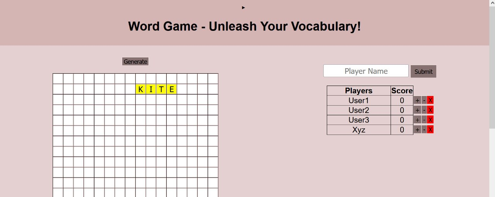

# Word Game

Word Game is an engaging and interactive vocabulary game where players create words by adding one letter at a time. It features customizable rules for an exciting and challenging gameplay experience. Players strategically build words to earn points and outsmart opponents, making it suitable for all ages and skill levels.

## Features

- Add/Delete Players
- Undo Selected Cells
- Input Player Names
- Scoring System
- Responsive Design

## Lessons Learned

  -  Effective **user input handling** and validation
  -   **Dynamic DOM manipulation** for interactive features
  -   Prioritizing intuitive UI/UX **design** for a better user experience

## FAQ

#### How do I play the Word Game?

To play the Word Game, each player takes turns adding a single letter to collectively form a word. The objective is to create meaningful words while strategically planning your moves to maximize points and outsmart opponents.

#### Can I customize the game rules?

Yes, the Word Game offers a flexible and customizable rule system. Players can define their own unique set of rules to make the gameplay more exciting and challenging.

<!-- Currently, the Word Game does not have a built-in word validation feature, time limit for each turn, or a save/load game progress functionality. However, these are potential enhancements that can be implemented in the future. Word validation can be added by checking entered words against a dictionary. A time limit feature can add excitement by requiring players to complete their turn within a specified timeframe. Implementing a save/load game progress feature would allow players to save their progress and resume the game later. Contributions to add these features are welcomed and can enhance the overall gameplay experience. -->
## Demo

[Link to demo](https://cvanshulll.github.io/Word_Game/)

## Screenshots

